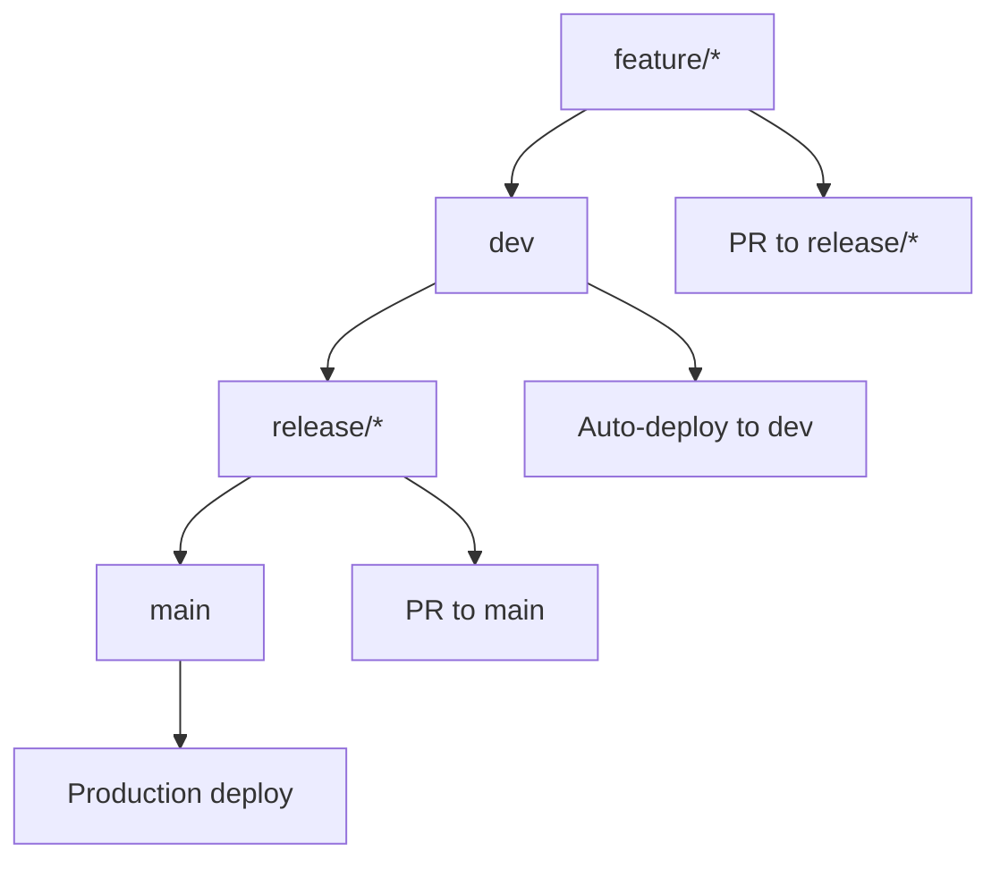

# UIForge Workflow Patterns Documentation

## Overview

This document describes the standardized workflow patterns used across all UIForge projects to ensure consistent development practices, quality standards, and security compliance.

## 🏗️ Architecture

### Base Workflow Templates

All UIForge projects use a set of base workflow templates that provide standardized CI/CD patterns:

- **`base-ci.yml`**: Core CI pipeline with linting, testing, and build verification
- **`base-security.yml`**: Comprehensive security scanning with multiple tools
- **`base-dependencies.yml`**: Automated dependency management with Renovate

### Project-Specific Extensions

Each project extends the base templates with project-specific configurations:

```yaml
# Example project-specific workflow
name: Project CI Pipeline
on:
  push:
    branches: [ main, dev, release/*, feature/* ]
  pull_request:
    branches: [ main, dev, release/*, feature/* ]

jobs:
  # Extend base CI jobs
  ci:
    uses: ./.github/workflows/base-ci.yml

  # Add project-specific jobs
  project-specific:
    runs-on: ubuntu-latest
    steps:
      - name: Project-specific step
        run: echo "Project-specific logic"
```

## 🔄 CI/CD Pipeline Flow

### Standard Pipeline Order

1. **Setup**: Install dependencies and configure environment
2. **Linting**: Code quality and style checks
3. **Testing**: Unit and integration tests with coverage
4. **Build**: Build artifacts and Docker images
5. **Security**: Security scanning and vulnerability detection
6. **Quality Gates**: Final quality checks and reporting

### Branch Strategy



### Environment Configuration

- **Development**: Auto-deploy from `dev` branch
- **Staging**: Manual deploy from `release/*` branches
- **Production**: Deploy from `main` branch merges

## 🧪 Testing Standards

### Coverage Requirements

- **Minimum Coverage**: 80% across all projects
- **Unit Tests**: Required for all business logic
- **Integration Tests**: Required for API endpoints and database operations
- **E2E Tests**: Required for critical user flows (webapp)

### Test Structure

```
tests/
├── unit/           # Unit tests
├── integration/    # Integration tests
├── e2e/           # End-to-end tests
├── fixtures/      # Test fixtures
└── helpers/       # Test utilities
```

### Test Naming Conventions

- **Unit Tests**: `*.unit.test.js` / `*.unit.test.py`
- **Integration Tests**: `*.integration.test.js` / `*.integration.test.py`
- **E2E Tests**: `*.e2e.test.js` / `*.e2e.test.py`

## 🔒 Security Standards

### Security Tools

All UIForge projects use a standardized security toolchain:

1. **Snyk**: Dependency and code vulnerability scanning
2. **CodeQL**: Static application security testing (SAST)
3. **Trufflehog**: Secret scanning
4. **Codecov**: Coverage reporting with security insights

### Security Scanning Schedule

- **On PR**: Full security scan for all changes
- **Daily**: Automated security scans at 2 AM UTC
- **Weekly**: Dependency health checks at 3 AM UTC

### Security Response Times

- **Critical**: 24 hours response time
- **High**: 72 hours response time
- **Medium**: 7 days response time
- **Low**: 30 days response time

## 📦 Dependency Management

### Renovate Configuration

All projects use Renovate for automated dependency management with:

- **Weekly Updates**: Monday at 3 AM UTC
- **Auto-Merge**: Patch and minor updates after 3-day stabilization
- **Grouping**: Dependencies grouped by type and update type
- **Labels**: Consistent labeling for easy tracking

### Dependency Categories

- **Production**: Core application dependencies
- **Development**: Build and development tools
- **Testing**: Test frameworks and utilities
- **Linting**: Code quality tools
- **Security**: Security scanning tools

### Update Types

- **Patch**: Bug fixes and security updates (auto-merge)
- **Minor**: New features and enhancements (auto-merge)
- **Major**: Breaking changes (manual review required)

## 📊 Quality Gates

### Must Pass (Blocking)

- [ ] All linting checks pass (0 errors)
- [ ] All tests pass (100% success)
- [ ] Code coverage ≥ 80%
- [ ] Security scans pass (no high/critical issues)
- [ ] Build verification succeeds

### Should Pass (Recommended)

- [ ] CodeRabbit suggestions addressed
- [ ] Performance benchmarks maintained
- [ ] Bundle size impact assessed
- [ ] Accessibility tests pass

### Monitoring (Non-blocking)

- [ ] Dependency health check
- [ ] License compatibility review
- [ ] Code complexity analysis
- [ ] Technical debt assessment

## 🚀 Performance Standards

### CI/CD Performance Targets

- **Total Pipeline Time**: < 15 minutes
- **Linting**: < 2 minutes
- **Testing**: < 5 minutes
- **Building**: < 3 minutes
- **Security Scanning**: < 5 minutes

### Application Performance Targets

- **API Response Time**: < 200ms
- **Web Page Load**: < 3 seconds
- **Memory Usage**: < 512MB for services
- **CPU Usage**: < 70% under normal load

## 📋 Maintenance Procedures

### Daily Tasks

- [ ] Monitor CI/CD pipeline performance
- [ ] Review security scan results
- [ ] Check for failed builds or tests

### Weekly Tasks

- [ ] Review dependency updates
- [ ] Check code coverage trends
- [ ] Monitor performance metrics
- [ ] Update documentation as needed

### Monthly Tasks

- [ ] Review and update templates
- [ ] Audit security configurations
- [ ] Analyze quality metrics
- [ ] Update tool versions

### Quarterly Tasks

- [ ] Comprehensive pattern review
- [ ] Update standards documentation
- [ ] Team training and alignment
- [ ] Performance optimization

## 🔄 Template Updates

### Update Process

1. **Identify Need**: Recognize need for template update
2. **Create Branch**: Create `feature/template-update` branch
3. **Update Templates**: Modify base templates and configurations
4. **Test Changes**: Verify changes work across projects
5. **Create PR**: Submit PR with detailed changes
6. **Review Process**: Get approval from maintainers
7. **Merge Changes**: Merge to main branch
8. **Update Projects**: Apply changes to all projects

### Version Control

- **Template Versioning**: Semantic versioning for templates
- **Change Log**: Document all template changes
- **Backward Compatibility**: Maintain compatibility when possible
- **Rollback Plan**: Have rollback procedures for breaking changes

## 🎯 Success Metrics

### Adoption Metrics

- **Template Consistency**: 100% of projects using shared templates
- **Workflow Standardization**: All CI workflows follow base patterns
- **Tool Unification**: Single dependency management tool across projects
- **Security Coverage**: All projects have consistent security scanning

### Quality Metrics

- **CI Performance**: < 15 minutes total pipeline time
- **Coverage Consistency**: 80% threshold across all projects
- **Security Response**: < 24 hours for critical vulnerabilities
- **Dependency Health**: < 5 outdated dependencies per project

### Maintenance Metrics

- **Template Updates**: Quarterly review and updates
- **Security Scanning**: Weekly automated scans
- **Dependency Updates**: Monthly review cycles
- **Documentation**: 90% coverage of patterns and procedures

## 🚨 Troubleshooting

### Common Issues

1. **Pipeline Failures**: Check logs for specific error messages
2. **Security Scanning**: Review vulnerability reports and fix critical issues
3. **Dependency Conflicts**: Resolve version conflicts and update lock files
4. **Coverage Drops**: Add tests for uncovered code paths

### Debugging Procedures

1. **Local Reproduction**: Reproduce CI failures locally
2. **Log Analysis**: Review detailed CI logs
3. **Incremental Testing**: Test individual components
4. **Environment Validation**: Verify CI environment setup

## 📚 Additional Resources

### Documentation

- [GitHub Actions Documentation](https://docs.github.com/en/actions)
- [Renovate Documentation](https://docs.renovatebot.com/)
- [Codecov Documentation](https://docs.codecov.com/)
- [Snyk Documentation](https://docs.snyk.io/)

### Tools and Utilities

- **GitHub CLI**: Command-line interface for GitHub
- **Act**: Local GitHub Actions runner
- **Docker**: Containerization platform
- **Node.js**: JavaScript runtime
- **Python**: Python interpreter

### Best Practices

- [Conventional Commits](https://www.conventionalcommits.org/)
- [Semantic Versioning](https://semver.org/)
- [GitHub Security Best Practices](https://docs.github.com/en/code-security)
- [CI/CD Best Practices](https://docs.github.com/en/actions/guides)

---

This documentation is part of the UIForge shared GitHub patterns standardization.
